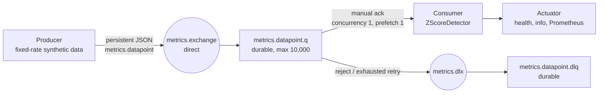

# Real-Time Anomaly Detector

A Java 25 / Spring Boot 4.1 system that continuously publishes synthetic temperature datapoints to RabbitMQ and evaluates them with a stateful, leave-one-out Z-score detector. It is deliberately small: one producer, one ordered consumer, and an operational-only HTTP surface. The implementation emphasizes delivery semantics, numerical behavior, and evidence a reviewer can reproduce.

## 1. Overview



- **Producer** emits `sensor.temperature` values at a fixed rate. With the committed default seed, its sequence and value/injection schedule are repeatable; UUIDs, event timestamps, and log identity are intentionally not.
- **RabbitMQ** supplies durable buffering, manual acknowledgements, redelivery, a dead-letter queue, publisher confirms, and a local management UI.
- **Consumer** validates, deduplicates, warns on sequence/event-time diagnostics, evaluates a framework-free `ZScoreDetector`, logs a verdict, records metrics, remembers the ID, then acknowledges.

The detector is concrete rather than hidden behind a speculative `AnomalyDetector` interface. The framework-free `consumer.detection` package is the future extraction seam.

## 2. Quickstart

Prerequisites: Docker with Compose v2 and free host ports from [Configuration](#7-configuration). Java 25 is needed only for Maven commands; `make up` builds inside the container.

```bash
make up
```

This delegates to `docker compose up --build` and remains attached to the log stream. Stop it from another terminal:

```bash
make down
```

The default stream has four points per second. Consumer logs initially show `WARMING_UP`, then `OK`/anomaly verdicts; the producer stays quiet except for injected anomalies. The first seeded injection observed from the committed defaults is **sequence 49, value 156.19**. Do not expect its timestamp or UUID to repeat.

### Measured local timings

These are observations on 2026-08-07 on the repository's Apple M1 workstation, not portability promises:

| Measurement | Command or condition | Observed time |
|---|---|---:|
| Image build without Docker layer cache | `docker compose build --no-cache`; Temurin base images already pulled | 72.00 s |
| Cached image rebuild | `docker compose build` immediately afterward | 1.52 s |
| Both readiness endpoints | cached `docker compose up --build -d` from a clean project teardown | 21.19 s |
| First seeded producer injection | same cached startup | 32.40 s from command start |
| First `SUMMARY | processed=100` | same cached startup | 44.77 s from command start |
| Full warm smoke, including build check, readiness, correlation, metrics, memory check, and teardown | `./scripts/smoke-test.sh` | 57.56 s |

Network, Docker cache state, and machine capacity affect all timings. The fixed 250 ms interval explains the timeline: the 30-sample floor is reached after about 7.5 seconds of producer data, and 100 processed points take about 25 seconds after the producer begins.

## 3. Verify the system

The repeatable end-to-end check is:

```bash
make smoke
```

It starts a clean Compose project and waits for both `/actuator/health/readiness` endpoints rather than inferring readiness from logs. Within 180 seconds it requires all of the following before its guaranteed `docker compose down -v` trap tears the project down:

1. An `INJECTED ANOMALY` producer line whose exact `emittedAt` and two-decimal `value` occur in a consumer `Status: ANOMALY DETECTED!` line.
2. The first consumer `SUMMARY | processed=100` line.
3. Prometheus exposition names `anomaly_detector_points_processed_total`, `anomaly_detector_points_anomalies_total`, `anomaly_detector_window_occupancy`, and `anomaly_detector_processing_seconds_count`.
4. A 404 from the excluded `/actuator/env` endpoint.
5. Consumer and producer memory below 80% of their 512 MiB Compose limits after sustained processing.

For a manual review, leave `make up` running and compare a producer injection with the consumer line by timestamp and value:

```text
[<emittedAt>] INJECTED ANOMALY seq=<n> value=<value> (+/-<sigma>σ)
[<same emittedAt>] Data point: <same value> | Status: ANOMALY DETECTED! | Z-score: <z> | ALERT: Significant deviation detected.
```

The consumer summary is a human-facing cumulative check: its anomaly percentage is `anomalies / processed`; its mean Z uses only finite scores. Prometheus is machine-facing at `http://localhost:8080/actuator/prometheus` by default.

RabbitMQ management is available at `http://localhost:15672` with the committed demo credentials `anomaly` / `anomaly`. Inspect `metrics.datapoint.q` for the main queue and `metrics.datapoint.dlq` for poison or exhausted messages. Those credentials are for the local demo only.

## 4. Demo: regime shift

Run the alternate demo without editing `.env`:

```bash
make demo-shift
```

That shell-only override sets `PRODUCER_LEVEL_SHIFT_ENABLED=true`. Sequence 400 is generated against the old mean, then the producer emits one level-shift line and sequence 401 is the first observation at the new mean. At the default four messages per second, reaching sequence 400 takes about 100 seconds of producer time.

Expected behavior:

```text
seq 400  *** LEVEL SHIFT at seq=400: mean 100.00 -> 150.00 (+10.0σ) ***
seq 401  ANOMALY DETECTED!
...
seq 405  ANOMALY DETECTED!  # fifth consecutive anomaly is admitted after scoring
seq 406+ window re-baselines; an OK verdict returns within the following 50 shifted points
```

The fifth point remains an anomaly verdict. It is the admission event: the buffered run of five anomaly values is appended in arrival order so the rolling reference can adapt. This is a demonstrable mitigation, not a claim that raw Z-score solves change detection.

## 5. Architecture, topology, and contract

The wire contract is [Draft 2020-12 JSON Schema](contracts/datapoint.v1.schema.json), not a shared Java JAR. Both services deliberately carry equivalent `Datapoint` records and validate the schema independently. The required fields are:

```json
{
  "id": "UUID",
  "sequence": 1,
  "metric": "sensor.temperature",
  "value": 100.42,
  "emittedAt": "2026-08-07T07:24:03.636Z"
}
```

`id` supports bounded deduplication, `sequence` supports diagnostics, and `emittedAt` is event time. Values are finite and constrained to `[-1e150, 1e150]`; unknown fields are accepted for forward compatibility. There is no producer ground-truth field such as `syntheticAnomaly`.

### RabbitMQ topology and delivery

```text
producer -- persistent publish --> metrics.exchange (direct)
                                  | routing key: metrics.datapoint
                                  v
                           metrics.datapoint.q (durable)
                           max length: 10,000; overflow: reject-publish
                                  | x-dead-letter-exchange: metrics.dlx
                                  v
metrics.dlx ----------------> metrics.datapoint.dlq (durable)
```

Both applications idempotently declare the same topology. The producer uses correlated confirms and mandatory returns; a return or nack is logged instead of silently retried. The consumer uses one manual-ack listener (`concurrency=1`, `prefetch=1`). Invalid payloads are rejected without requeue. Unexpected processing failures receive three in-thread attempts with 250 ms initial backoff, a 2x multiplier, and a 2 s cap; exhaustion republishes one persistent failure copy to the DLQ after confirmation, then terminates the original delivery.

### Production-system mapping

| Concern | RabbitMQ here | SQS / Kinesis / Kafka analogue |
|---|---|---|
| Route or partition key | direct-exchange routing key | SQS FIFO `MessageGroupId`; Kinesis partition key; Kafka record key |
| Ordered state | one queue consumer with prefetch 1 | one FIFO message group; one Kinesis shard consumer; one Kafka partition consumer |
| Ack after processing | manual `basicAck` | SQS delete after success / visibility timeout; Kinesis checkpoint; Kafka offset commit |
| Durable buffer | durable queue + persistent message | SQS queue; Kinesis retention; Kafka topic retention |
| Poison handling | DLX + `metrics.datapoint.dlq` | SQS redrive policy; an explicit Kinesis poison-record path; Kafka dead-letter topic |

The operational semantics are analogous, not interchangeable: standard SQS does not supply this queue's ordering, and each platform has distinct retry, retention, and ordering rules.

## 6. Statistical model

For a candidate value $x_t$, the detector computes:

$$
Z = \frac{|x_t - \mu|}{\hat{\sigma}}
$$

against the rolling window **before** admitting $x_t$. An anomaly is strictly `Z > 3.0`.

- Window capacity defaults to 50 and is bounded to 50–100. Mean and sample standard deviation are recomputed in two O(N) passes; sample variance uses Bessel's $n-1$ divisor.
- Leave-one-out avoids the self-inclusion ceiling $(n-1)/\sqrt{n}$ (about 6.93 at N=50), which makes an extreme point inflate its own reference variance.
- No scoring occurs until 30 samples. A constant or near-constant reference window (`sigma < 1e-12`) yields `DEGENERATE_WINDOW`, never `NaN` or infinity.
- Negative and zero values are valid. The detector is stateful, serialized, and not thread-safe.

### Contamination and the K=5 trade-off

Detected anomalies are excluded from the reference window so one outlier cannot inflate the variance and mask the next. That clean-reference policy has a real counter-failure: a legitimate level shift would otherwise remain anomalous forever because the reference never moves.

The chosen escape hatch is five consecutive anomalies. They are buffered; an intervening normal point discards a short buffered run, while the fifth anomaly admits all five in order. Continued shifts are admitted in groups of five and the bounded window re-baselines. **K=5 is a judgement call, not a tuned statistical constant.** Labelled data or a dedicated change-point detector (for example CUSUM) is the production answer.

The leave-one-out score with estimated sample sigma is t-like rather than exactly standard normal. The implementation follows the specified formula rather than adding a silent correction, so normal-theory false-positive estimates are only approximations.

## 7. Configuration

Compose reads `.env`; shell environment values can override its interpolation values. The consumer and producer also have the defaults shown below when run outside Compose. Invalid ranges and cross-field combinations fail at startup.

| Variable | Default / Compose value | Purpose |
|---|---|---|
| `RABBITMQ_USERNAME` | `anomaly` | Local broker username |
| `RABBITMQ_PASSWORD` | `anomaly` | Local broker password; replace outside the demo |
| `RABBITMQ_HOST` | `rabbitmq` in Compose; `localhost` otherwise | AMQP host |
| `RABBITMQ_PORT` | `5672` | AMQP port used by applications |
| `RABBITMQ_AMQP_PORT` | `5672` | Published host AMQP port |
| `RABBITMQ_MANAGEMENT_PORT` | `15672` | Published RabbitMQ management port |
| `CONSUMER_HTTP_PORT` | `8080` | Consumer Actuator port |
| `PRODUCER_HTTP_PORT` | `8081` | Producer Actuator port |
| `DETECTOR_WINDOW_SIZE` | `50` | Bounded rolling capacity (50–100) |
| `DETECTOR_Z_THRESHOLD` | `3.0` | Strict anomaly threshold; finite and at least 0.5 |
| `DETECTOR_MIN_SAMPLES` | `30` | Warm-up floor; 2 through window size |
| `DETECTOR_EXCLUDE_ANOMALIES` | `true` | Keep isolated anomaly verdicts out of the reference window |
| `DETECTOR_CONSECUTIVE_OVERRIDE` | `5` | Consecutive-anomaly admission threshold; 2 through window size |
| `DETECTOR_SUMMARY_EVERY` | `100` | Successful non-duplicate points between summaries |
| `PRODUCER_INTERVAL_MS` | `250` | Fixed-rate generation interval |
| `PRODUCER_MEAN` | `100.0` | Baseline normal-distribution mean |
| `PRODUCER_STDDEV` | `5.0` | Baseline standard deviation; positive |
| `PRODUCER_ANOMALY_PROBABILITY` | `0.02` | Per-point injection probability |
| `PRODUCER_ANOMALY_SIGMA_MIN` | `8.0` | Minimum injected magnitude in sigma units |
| `PRODUCER_ANOMALY_SIGMA_MAX` | `12.0` | Maximum injected magnitude in sigma units |
| `PRODUCER_SEED` | `42` | Seeded deterministic sequence/value schedule; blank selects nondeterministic `Random` |
| `PRODUCER_LEVEL_SHIFT_ENABLED` | `false` | Enable the regime-shift demo |
| `PRODUCER_LEVEL_SHIFT_AT_SEQUENCE` | `400` | Old-mean final sequence / shift event sequence |
| `PRODUCER_LEVEL_SHIFT_SIGMA` | `10.0` | Permanent mean step in sigma units |
| `LOG_FORMAT` | `plain` | `plain` R11-style output or opt-in `json` structured console output |

The generated-value safety check constrains the configured mean, shift, anomaly maximum, and standard deviation to the accepted numeric domain.

## 8. Design decisions

The detailed rationale lives in concise Context / Decision / Consequences ADRs:

1. [ADR 0001 — Language and framework](docs/adr/0001-language-and-framework.md)
2. [ADR 0002 — Messaging system](docs/adr/0002-messaging-system.md)
3. [ADR 0003 — Leave-one-out scoring](docs/adr/0003-leave-one-out-scoring.md)
4. [ADR 0004 — Anomaly window admission](docs/adr/0004-anomaly-window-admission.md)
5. [ADR 0005 — Single-threaded consumption](docs/adr/0005-single-threaded-consumption.md)
6. [ADR 0006 — Operational HTTP surface](docs/adr/0006-operational-http-surface.md)

At a glance: Java 25 and Spring Boot 4.1 match the implemented toolchain; RabbitMQ makes durable acknowledgment and DLQ behavior visible; O(N) recomputation avoids fragile running-variance deletion; one consumer preserves state order; and HTTP is Actuator-only with an explicit allowlist.

## 9. Known limitations

### Statistical and delivery limits

- Raw Z-score assumes stationary, approximately normal data. It has no seasonality model and is not a change-point detector.
- Threshold 3.0 and K=5 are unlabelled-data guesses. Under ideal normal theory, `Z > 3` is about 0.27% per point; the finite leave-one-out estimate is t-like and the practical rate is closer to the approximate 0.4% table below, not a calibrated precision/recall promise.

| Threshold | Approximate false-positive rate | At 4 points/s, rough interval |
|---:|---:|---:|
| 3.0 | about 0.4% | about one minute |
| 3.5 | about 0.1% | about four minutes |
| 4.0 | about 0.02% | about twenty minutes |

- Window state, the bounded ID cache, and sequence state are in memory. A restart loses the reference and dedup history, then warms up again; there is no persistence or atomic exactly-once boundary. Processing remembers a successful ID before ack to reduce redelivery double counting, but the system intentionally remains at-least-once.
- There is one metric and one ordered consumer partition. Gaps and out-of-order values are warned about and evaluated in arrival order, not reordered. Bounded per-key multi-metric state with TTL has not been built.
- Alerts are emitted per anomalous point. There is no alert deduplication, suppression, labelled-data tuning, replay/backfill, or SLO/error-budget policy.
- Prometheus export is already implemented. The missing observability work is scrape aggregation, retention, alerting, and dashboards—not another metrics endpoint.
- There is no schema registry/version governance, TLS/secrets integration, or production credential lifecycle.

### Deliberately not built

| Not built | Why |
|---|---|
| Business REST API | Both web servers expose Actuator operations only; no HTTP input drives the detector. |
| Detection or window persistence | Out of scope for the exercise; restart blindness is named above rather than hidden. |
| Kubernetes manifests | The requirement is to discuss deployment readiness, not ship manifests or a chart. |
| Prometheus/Grafana containers | The live `/actuator/prometheus` endpoint is enough for the scope; composing dashboards adds review surface. |
| Multi-metric partitioning | The design documents partition-by-key, but the implementation intentionally owns one metric/window. |
| Gradual-drift injection | Drift needs a different detector question; the level-shift demonstration stays focused. |
| A second detector | MAD, Hampel, EWMA, and CUSUM are discussed as alternatives, not extra configuration axes. |
| Web UI | The management UI and Actuator surface provide the required operational visibility. |
| Kafka runtime | It is a production mapping, not a required local broker or a second deployment topology. |

## 10. Testing and CI

| Layer | Command | Evidence |
|---|---|---|
| Full Maven reactor | `./mvnw -B verify` | Unit, contract, architecture, RabbitMQ/Testcontainers, and HTTP integration tests |
| Shortcut | `make test` | Delegates to `./mvnw verify` |
| Detection mutation gate | `./mvnw -B -pl consumer -Pmutation org.pitest:pitest-maven:mutationCoverage` | PIT scope is `consumer.detection`; threshold is 80% |
| Compose build | `docker compose config --quiet && docker compose build` | Compose syntax and production image build |
| End-to-end | `make smoke` | Readiness, timestamp/value anomaly correlation, summary, metrics, endpoint allowlist, memory, teardown |
| Shift walkthrough | `make demo-shift` | Reproducible K=5 admission/re-baselining trace |

The GitHub Actions workflow uses the same Maven wrapper, retained PIT gate, and smoke script for pushes and pull requests. On failure it uploads Surefire, Failsafe, and PIT reports. It uses the runner's Docker service; it does not introduce Docker-in-Docker, image publication, deployment, or release automation.

## 11. Up Next

### Day 1: developer feedback and guardrails

- Keep the existing CI workflow, then add Spotless + Checkstyle, SpotBugs/Error Prone, and a JaCoCo coverage floor on `consumer.detection`.
- Add Dependabot or Renovate for dependency update visibility.
- Tune threshold and K from labelled data against explicit precision/recall goals before attaching a real alert channel.

### Day 30: supply chain and operational depth

- Add Trivy image scanning and a CycloneDX SBOM.
- Adopt conventional commits plus semantic-release when releases are actually published.
- Run schema-registry contract tests in CI and introduce registry/version governance.
- Add a load harness, scrape aggregation/retention, dashboards, alert routing/suppression, replay/backfill, and SLO/error-budget definitions.

### Kubernetes readiness, not Kubernetes artifacts

The non-root images are Kubernetes-compatible, and `/actuator/health/liveness` plus `/actuator/health/readiness` are available. Rabbit connectivity is deliberately part of readiness and absent from liveness. That does **not** mean this repository is deployable to Kubernetes without further work.

A production deployment still needs manifests or Helm, resource requests/limits, a ConfigMap/Secret split, a managed broker, delivery tooling, a PodDisruptionBudget, and `terminationGracePeriodSeconds` aligned with the 30-second listener drain. Scaling cannot mean more consumers on the same ordered window: partition by metric key, bind one stateful consumer per partition, and scale with KEDA on per-partition queue depth. Add bounded per-key state with TTL before enabling multi-metric scale-out.

### Missing technical requirements

Beyond Kubernetes, production use needs persisted detector/dedup state, bounded multi-metric state with expiry, alert suppression, scrape aggregation and dashboards, labelled-data threshold tuning, seasonality handling, schema registry/versioning, TLS and secrets management, replay/backfill, and explicit SLOs/error budgets. Those omissions are intentional scope boundaries, not claims that the current three-container demo solves production anomaly operations.
